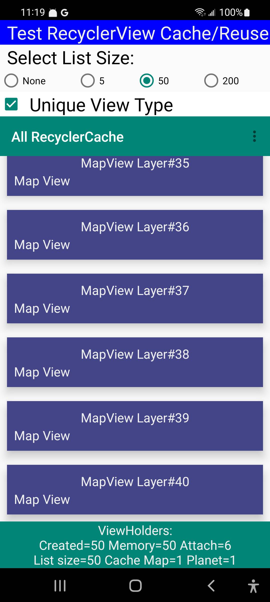
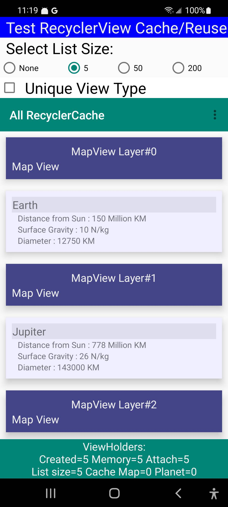

# all-recycler-cache

## Sample app to measure RecyclerView cache management. 

The following screen samples show the impact of how ViewType controls how many 
ViewHolders are cached for easy reuse.  

Some related articles:
- <a href="https://medium.com/android-news/anatomy-of-recyclerview-part-1-a-search-for-a-viewholder-404ba3453714">Anatomy of RecyclerView: a Search for ViewHolder by Pavel Shmakov (Mar, 2017) </a>a>
- <a href="https://segmentfault.com/a/1190000040421118/en">In-depth understanding of the caching mechanisum of Android RecyclerView by xiangzhihong July-2021</a>a>

The RecyclerView is populated with two possible item types which demonstrate two different layouts:
- Planet 
- Map 

The controls at the top of the screen control how the RecyclerView is filled. 
- Checkbox  "Unique View Type" controls whether the ViewType value is unique for all items 
or returns one of two values associated with the two card types.
- Radio buttons  "Select List Size" control how many items are placed in RecyclerView. 

Status is displayed at the bottom of screen under the RecyclerView
- Holders = # of ViewHolder instances active in memory (in view or cached)
- Attached = # of ViewHolders currently attached to screen (in view).
- List size = # of items in list passed to Adapter passed to RecyclerView
- Cache Map/Planet - shows the number of items per ViewType in the RecyclerView pool cache. 
 The RecyclerView has two caches, this is only one of them. 
- Memmory Stress = additional list of strings, one allocated every minute to apply
some stress on the memory system.  Not sure this makes any difference. 

## ViewType per card type (cache small, good reuse)

Example shows ViewType set to same value for each of the two possible types, 
allowing the <b>RecyclerView</b> to reuse <b>ViewHolders</b> which go out of view. 
List is populated with 50 semi-random items of two types ("planets" and "map" cards)
Status on the bottom shows the active view Holder count is 13 and 6 are attached to the view. 
There are 5 cards in full view, one must be partially in view and the RecyclerView is caching 7 additional (5+1+7=13 active viewholders)

## ViewType unique per row (caching all items, poor reuse)

- The ViewType is set to return a unique value for every item, resulting in no reuse and 
every item created (result of scrolling) is kept in cache. 50 items = 50 cached. 

## Short list (5 items, all in view) all items cached, no reuse.

