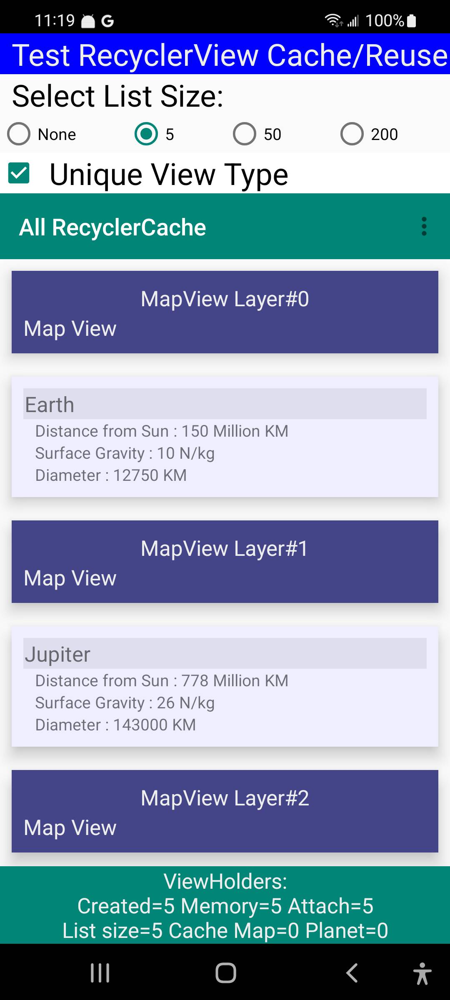

# all-recycler-cache

By: Dennis Lang

Dt: Oct-2022

## Sample app to measure RecyclerView cache management. 

This Android app demonstrates how <b>ViewType</b> impacts the caching and reuse of ViewHolders.
 

### Some related articles:
- <a href="https://medium.com/android-news/anatomy-of-recyclerview-part-1-a-search-for-a-viewholder-404ba3453714">
    Anatomy of RecyclerView: a Search for ViewHolder by Pavel Shmakov (Mar, 2017) </a>
- <a href="https://segmentfault.com/a/1190000040421118/en">
    In-depth understanding of the caching mechanisum of Android RecyclerView by xiangzhihong (July-2021)</a>

The RecyclerView is populated with two different item types to demonstrate different layouts:
- Planet 
- Map 

The controls at the top of the screen control how the RecyclerView is filled. 
- Checkbox  "Unique View Type" controls whether the <b>ViewType</b> value is unique for all items 
or returns one of two values associated with the two card types.
- Radio buttons  "Select List Size" control how many items are placed in RecyclerView. 
Changing the list size causes a new list to be created, adapter to be rebuilt and attached to 
the RecyclerView and <b>java garbage collector</b> to be called. 

Status is displayed at the bottom of screen under the RecyclerView
- Created = Number of <b>ViewHolder</b> instances created (called constructor)
- Memory = Number of <b>ViewHolder</b> instances active in memory (in view or cached)
- Attach = Number of <b>ViewHolders</b> currently attached to screen (in view).
- List size = Number of <b>items</b> in list passed to Adapter passed to RecyclerView
- Cache Map/Planet - shows the number of items per <b>ViewType</b> in the RecyclerView pool cache. 
 The RecyclerView has two caches, this is only one of them. See [reference documents linked at the top.](#Some-related-articles)
- Memmory Stress = additional list of strings, one allocated every minute to apply
some stress on the memory system.  Not sure if this makes any difference. 

## ViewType per card type (cache small, good reuse)

Example shows ViewType set to card type for each of the two possible cards (Map or Planet), 
allowing the <b>RecyclerView</b> to reuse <b>ViewHolders</b> which go out of view. 
List is populated with 50 semi-random items of two types ("planets" and "map" cards)
Status on the bottom shows 20 ViewHolders created, 15 in memory and 6 attached to view.  
There are 6 cards in full view and the RecyclerView is caching 8 additional (6+9=15 viewholders in memory)

Values appear after selecting 50 items and scrolling through entire list a few times. 

## ViewType unique per row (caching all items, no reuse)

The ViewType returns a unique value for every item, resulting in no reuse and 
every item created as you scroll with all items kept in cache. 50 items = 50 cached. 
Nothing is reused.  

## Short list (5 items, all in view) all items cached, no reuse.

